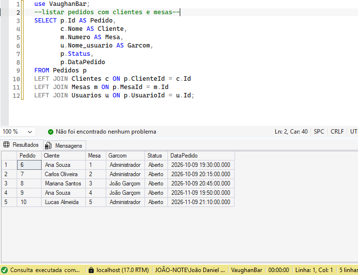
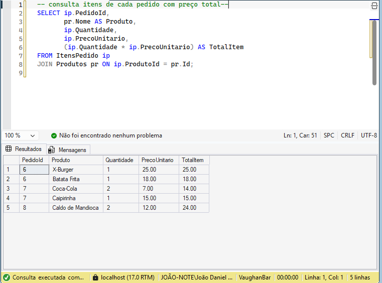
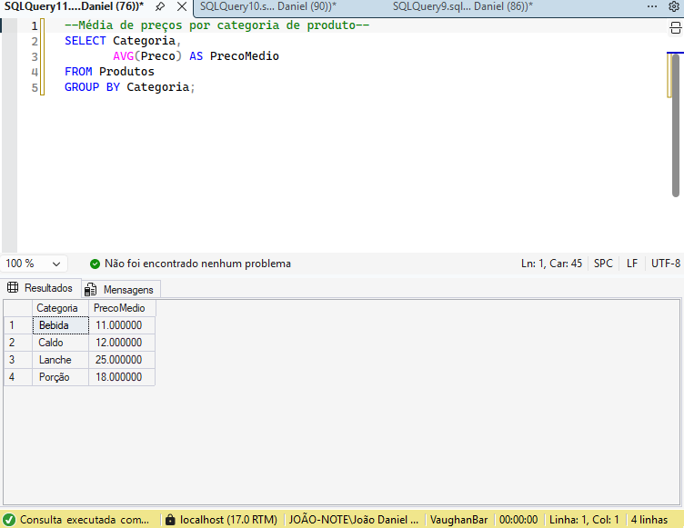

# Vaughan

Sistema acadêmico de gestão para bares e restaurantes, com mesas, comandas, produtos, estoque, usuários e relatórios de vendas.

Esta edição de portfólio apresenta o projeto desenvolvido no contexto acadêmico e documenta sua implementação. O código utiliza C# e SQL, sendo o caminho completo entre a interface, as requisições HTTP e o banco relacional.

**Status:** demonstração local em evolução. A autenticação atual não é adequada para publicação em produção. Consulte as [limitações conhecidas](docs/LIMITACOES.md).

## Tecnologias

| Camada | Implementação |
| --- | --- |
| Interface | HTML, CSS, Bootstrap e jQuery |
| Servidor | C# / .NET 8, aplicação console com `HttpListener` |
| API | Roteamento manual e respostas JSON |
| Persistência | SQL Server e ADO.NET (`Microsoft.Data.SqlClient`) |
| Organização | Handlers, repositórios, modelos e gerenciamento de sessões |

O servidor não utiliza ASP.NET Core. O acesso ao banco não utiliza ORM.

## Funcionalidades implementadas

- Login e distinção entre os cargos de gerente e garçom.
- Consulta de mesas e gestão de comandas.
- Cadastro e manutenção de produtos.
- Inclusão e remoção de itens, com movimentação de estoque.
- Registro do preço do produto no momento da venda.
- Relatórios de vendas e consulta de estoque baixo.
- Gestão de usuários restrita ao gerente.

Essas funcionalidades foram identificadas no código. A documentação não representa uma certificação de funcionamento ou de segurança; veja o roteiro de validação no guia de execução.

## Evidências do trabalho com SQL

As imagens abaixo são capturas de consultas já presentes no projeto acadêmico. Não são capturas novas da aplicação nem resultados de testes desta edição.

### Pedidos, clientes, garçons e mesas



### Itens e valores de pedidos



### Preço médio por categoria



## Executar localmente

Pré-requisitos: Windows, SDK .NET 8, SQL Server local e SQL Server Management Studio.

1. Prepare um banco de demonstração seguindo a [ordem dos scripts SQL](docs/EXECUCAO.md).
2. Na raiz deste repositório, execute:

```powershell
dotnet restore .\VaughanBar\VaughanBar.csproj
dotnet run --project .\VaughanBar\VaughanBar.csproj
```

3. Abra `http://localhost:5050/`.
4. Use exclusivamente no ambiente local o usuário de demonstração `admin`, senha `admin123`, criado pelo script de extensão.

A configuração padrão usa a instância SQL Server `localhost`, o banco `VaughanBar` e autenticação do Windows. Para uma instância Express ou problemas de conexão, consulte o [guia de execução](docs/EXECUCAO.md).

## Organização

| Caminho | Conteúdo |
| --- | --- |
| `VaughanBar/Http/` | Servidor, roteamento, requisições e arquivos estáticos |
| `VaughanBar/Handlers/` | Tratamento das operações da API |
| `VaughanBar/Repositories/` | Consultas e operações SQL |
| `VaughanBar/Models/` | Modelos de dados |
| `VaughanBar/Security/` | Sessões em memória |
| `VaughanBar/wwwroot/` | Páginas, estilos e JavaScript |
| `*.sql` na raiz | Scripts acadêmicos de criação, extensão, dados e consultas |
| `docs/` | Guias, limitações, capturas e documentação técnica |

## Decisões técnicas que podem ser estudadas

- Consultas parametrizadas nos repositórios.
- Uso de `SqlTransaction` em operações de comandas e estoque.
- Separação entre tratamento HTTP e persistência.
- Relacionamentos entre clientes, pedidos, itens, produtos, mesas e usuários.
- Preservação do preço unitário registrado na venda.

## Documentação

- [Execução local e roteiro de validação](docs/EXECUCAO.md)
- [Detalhes técnicos e endpoints](VaughanBar/README.md)
- [Limitações e próximos passos](docs/LIMITACOES.md)
- [Documentação técnica acadêmica em PDF](docs/documentacao-tecnica-vaughan-bar.pdf)
- [Alterações de apresentação desta edição](docs/ALTERACOES-PORTFOLIO.md)

## Contexto e autoria

Projeto de origem acadêmica, apresentado no portfólio de [Leonardo Brasil](https://github.com/leobrasil777-lang). Esta edição mantém a implementação como base de estudo e separa as melhorias de apresentação das futuras alterações funcionais.

O repositório não atribui autoria exclusiva de todas as partes nem acrescenta uma licença de redistribuição. Créditos e condições dos materiais existentes devem ser preservados.
